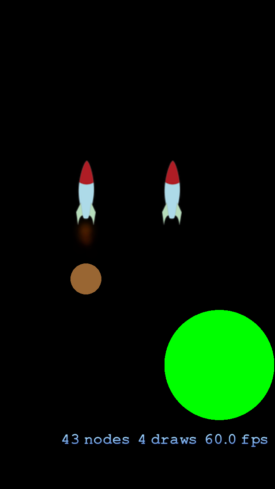

# Sprite Kit Physics Collisions

This example demonstrates physics and collisions between objects when using Sprite Kit. The ship on the left when the app launches is controllable by the player using the following controls:

* Tap left of the ship – `Turn Left`
* Tap right of the ship – `Turn Right`
* Tap below the ship – `Travel Forward`
* Tap above the ship – `Travel Backward`
* Tap on the ship – `Fire weapon`

