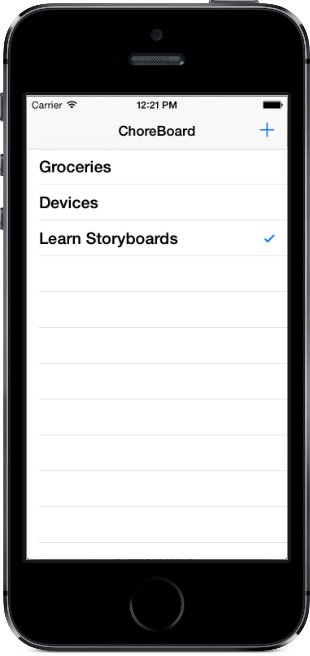

# Storyboard Tables

This sample is a demonstration of the final application that will be produced at the end of the [Tables and Storyboards](https://docs.microsoft.com/xamarin/ios/user-interface/controls/tables/creating-tables-in-a-storyboard) guide.

