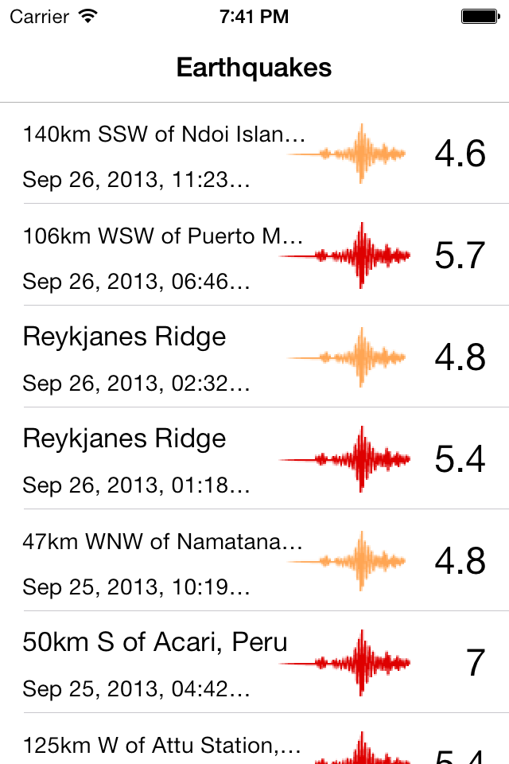

# ThreadedCoreData

This sample shows how to use Core Data in a multi-threaded environment.It downloads and parses an RSS feed in GeoJSON format from the United States Geological Survey (USGS) that provides data on recent earthquakes around the world. This sample persistently stores earthquakes between two managed object contexts using Core Data.
Each time you launch the app, it downloads new earthquake data, parses it in an NSOperation which checks for duplicates and stores newly founded earthquakes as managed objects. 

This sample shows how to use separate managed object context for each thread and share a single persistent store coordinator.

## Authors

Oleg Demchenko