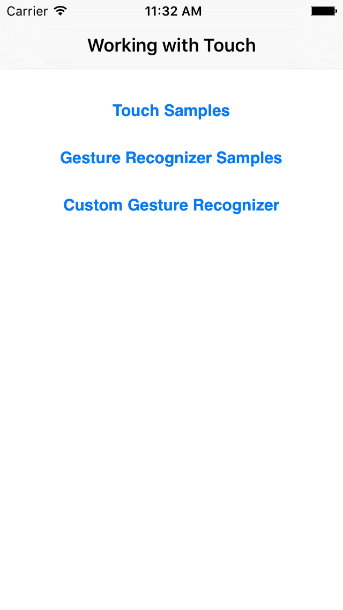

# Touch

This sample illustrates how to work with touch in iOS. Specifically, it shows
how to handle touch events, use pre-defined gesture recognizers, and create
custom gesture recognizers. 

See also the [touch samples](https://github.com/xamarin/monotouch-samples/tree/master/ApplicationFundamentals) associated with the [touch docs](http://developer.xamarin.com/guides/cross-platform/application_fundamentals/touch/).

## Authors

Bryan Costanich
