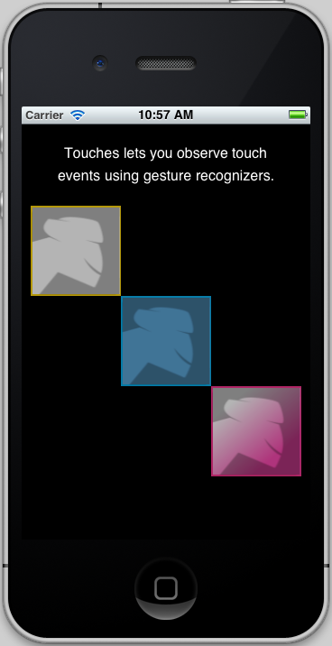

# Gesture Recognizers

An example on how to handle touches to move multiple objects.
Touches_GestureRecognizers demostrate how to do it with UIGestureRecognizers.

Loosely based on Apple's Touches example:
http://developer.apple.com/library/ios/#samplecode/Touches

## Authors

Mike Krüger
