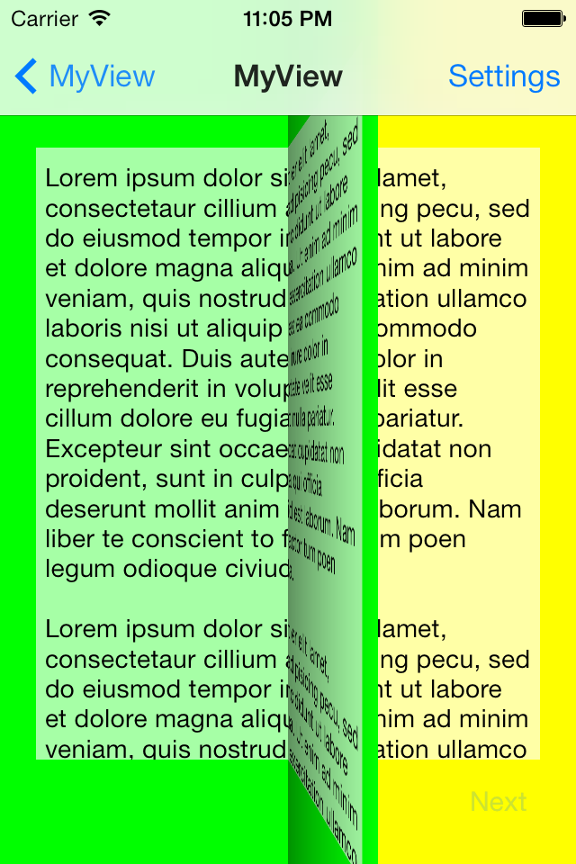
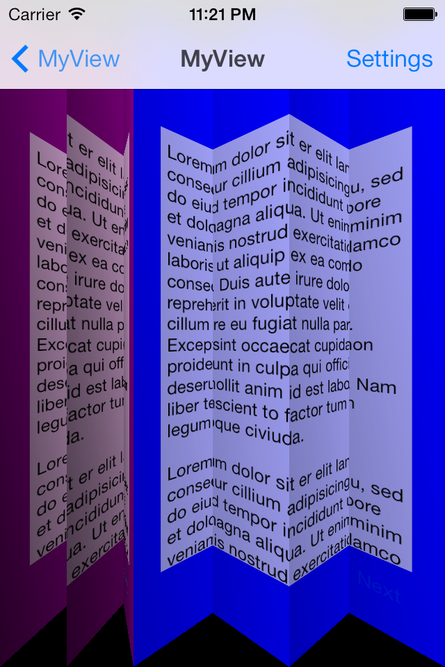
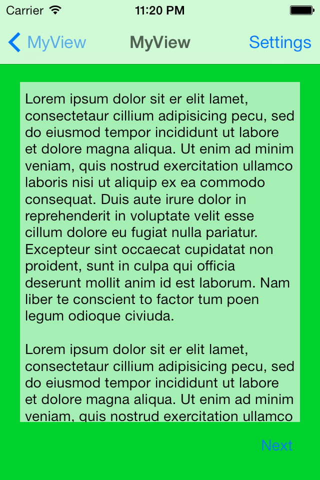
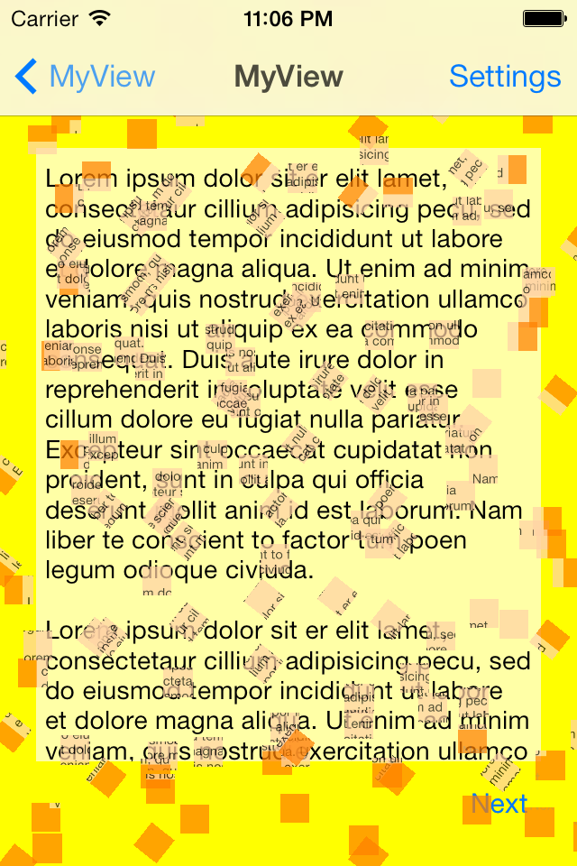
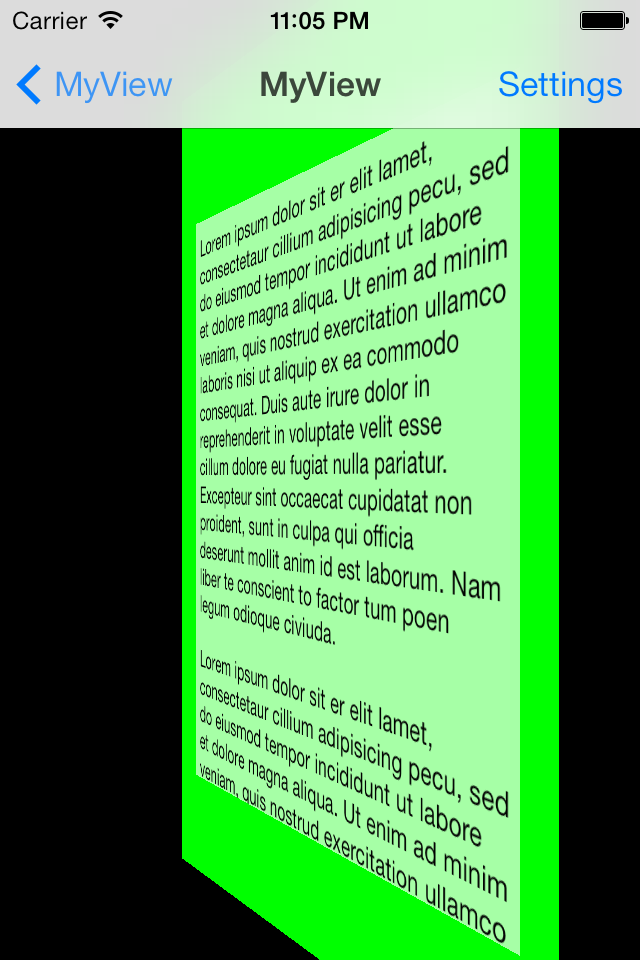
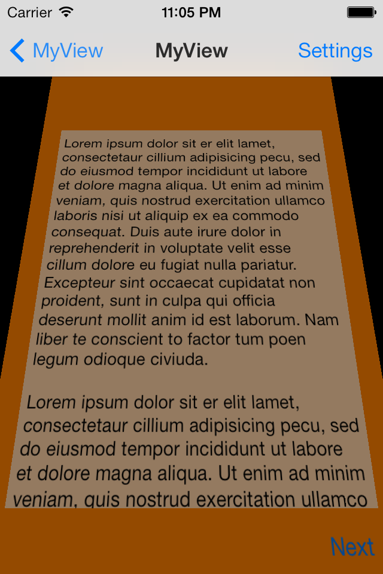

Transitions Demo
================

This sample shows how to create custom view controller transitions in iOS 7. Transitions can be used in a range of contexts: push, pop, modal etc.
Sample project provides a library of custom animations which can be dropped directly into your project. It also has a number of 'interaction controllers' which can be used with any of the custom animations in order to make your transitions interactive.

Library currently contains the following transition animations:
<table>
<tr>
<th>Flip</th>
<th>Fold</th>
<th>Crossfade</th>
<th>Explode</th>
</tr>
<tr>
<td></td>
<td></td>
<td></td>
<td></td>
</tr>
<tr>
<th>Turn</th>
<th>Cards</th>
</tr>
<tr>
<td></td>
<td></td>
</tr>
</table>

Authors
-------

Oleg Demchenko