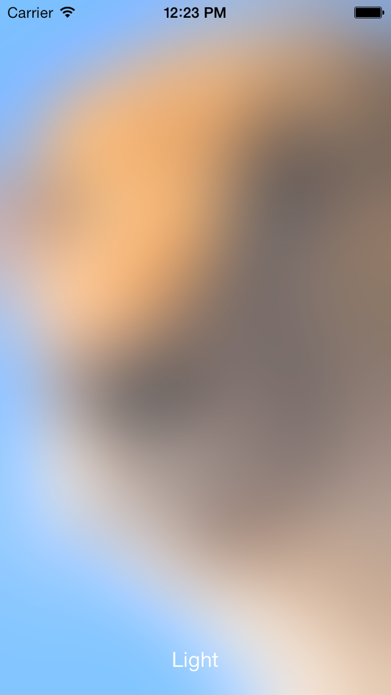

# Image Effects

This is a port of Apple's UIImageEffect sample.

## Main classes

- **ViewController.cs** – Calls the various filters on each tap.
- **UIImageEffect.cs** – Contains various extension methods that allow the user to blur images and tint those images.  The convenience methods show how to use the API.

