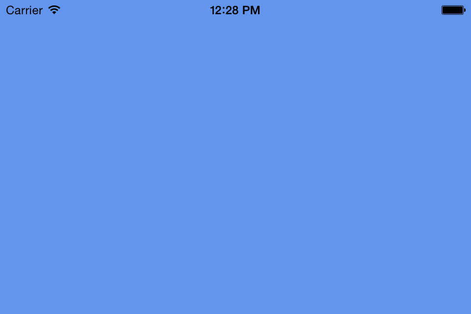

# MonoGame Empty Project for iOS

This project serves as a starting-point for MonoGame iOS projects.  It is the result of working through the [Creating iOS MonoGame Project walkthrough](https://docs.microsoft.com/xamarin/graphics-games/monogame/introduction/part1).  It is titled WalkingGame as that is the name of the project created by the full Introduction to MonoGame walkthrough.

This single solution contains two projects:  one for iOS and one cross-platform portable class library.

When executed this project displays only a blue screen.

## Author

Victor Chelaru