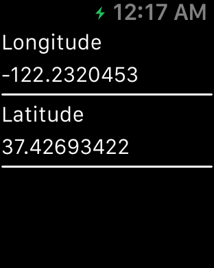

# GPS Watch

**WARNING:** This sample was written for watchOS 1, where the Watch Extension runs on the paired iPhone. 

The sample shows how to communicate directly with your `containing iOS App` via `OpenParentApplication` method.

## Instructions

* Launch WatchApp on Watch Simulator.
* Launch GpsWatch (MainApp/containing iOS app) and allow location service.

## Build Requirements

Building this sample requires Xcode 6.2 and iOS 8.0 SDK

## Target
This sample is runnable on iPhoneSimulator 8.2 and Watch Simulator

## Author

Created with Xamarin.iOS by Rustam Zaitov
