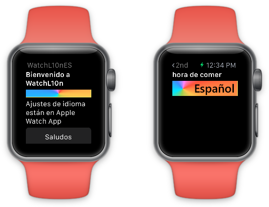

WatchLocalization (WatchKit)
============================

**NOTE:** There is an [updated watchOS 3 version](https://github.com/xamarin/ios-samples/tree/master/watchOS/WatchLocalization)

Sample code for the Xamarin.iOS Watch Kit [Localization] documentation.

Author
------

Created with Xamarin.iOS by Craig Dunn.

*Watch screenshots use [Bezel] courtesy of [infinitapps] :)*
*Watch bezel art courtesy of [Max Rudberg]*

[Localization]:http://developer.xamarin.com/guides/ios/watch/working-with/localization
[Bezel]:http://infinitapps.com/bezel/
[infinitapps]:http://infinitapps.com/
[Max Rudberg]:http://blog.maxrudberg.com/post/110056879433/apple-watch-bezels-for-bezel
