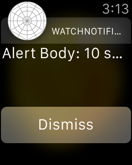

# WatchNotifications (WatchKit) 

Sample code for the Xamarin.iOS Watch Kit [Notifications] documentation.

NOTE: for a local notification to appear on the watch, trigger it in the app (button press) then *shut off the iPhone's screen* (press the power button once). If the iPhone is active then iOS will route the local notification to the iPhone and **NOT** the Watch.

Testing local notifications properly can only be done on a real iPhone and Watch. When using the iOS Simulator notifications can only be "faked" using a `.json` file.

  application screenshot")

## Author

Created with Xamarin.iOS by Craig Dunn.

*Watch screenshots use [Bezel] courtesy of [infinitapps] :)*  
*Watch bezel art courtesy of [Max Rudberg]*

[Notifications]:http://developer.xamarin.com/guides/ios/watch/notifications
[Bezel]:http://infinitapps.com/bezel/
[infinitapps]:http://infinitapps.com/
[Max Rudberg]:http://blog.maxrudberg.com/post/110056879433/apple-watch-bezels-for-bezel