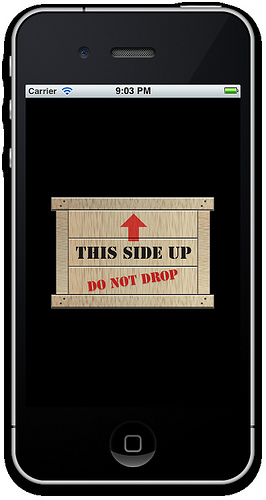

# Way Up Sample

An example showing the usage of the `ShouldAutorotateToInterfaceOrientation` method.

Based on the Apple sample:
https://developer.apple.com/library/ios/#samplecode/WhichWayIsUp/Introduction/Intro.html

