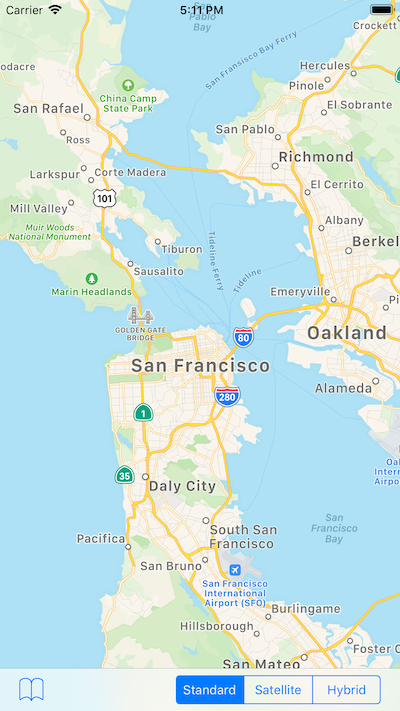

# World Cities

A simple example of using the Map Kit API in a MonoTouch application.
Based on Apple's sample:
https://developer.apple.com/library/ios/#samplecode/WorldCities/Introduction/Intro.html#//apple_ref/doc/uid/DTS40009466

## Requires

iOS 5.0 and up.

## Authors

Mike Krüger 
