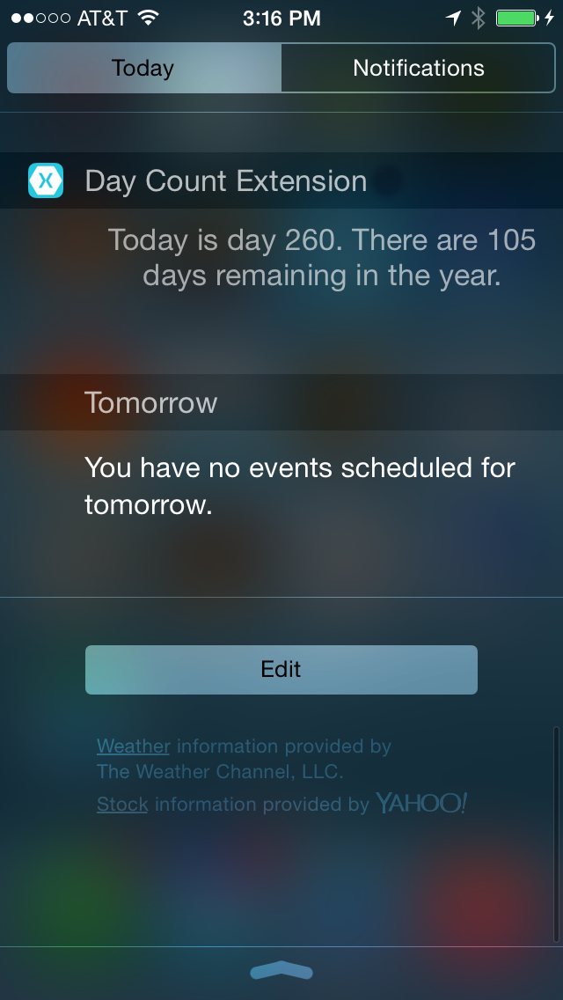

# iOS Today Widget extension demo

This sample shows how to create a today widget extension. It is the end result of the walkthrough in the [Introduction to Extensions](https://docs.microsoft.com/xamarin/ios/platform/extensions#Walkthrough) guide.

