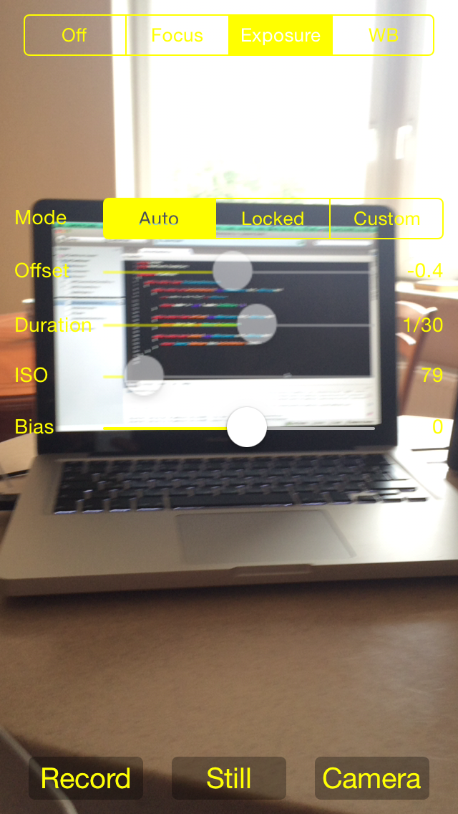

# AVCamManual

`AVCamManual` adds manual controls for focus, exposure, and white balance to the AVCam sample application. `AVCamManual` now uses `AVCapturePhotoOutput` rather than `AVCaptureStillImageOutput`, and adds support for raw photo capture.

## Build Requirements

Xcode 8, iOS 10 SDK

## Refs

[Original sample](https://developer.apple.com/library/prerelease/content/samplecode/AVCamManual/Introduction/Intro.html#//apple_ref/doc/uid/TP40014578)

## Target

This sample runnable on iPhone/iPad

## License

Xamarin port changes are released under the MIT license.
