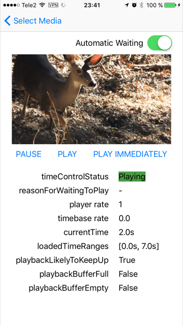

# AVAutoWait

This sample demonstrates how to use automatic waiting to deal with bandwidth limitations when playing HTTP live-streamed and progressive-download movies. This sample highlights what properties you should consider and how automatic waiting affects your user interface.

## Build Requirements

Building this sample requires Xcode 8.0 and iOS 10.0 SDK

## Target

This sample runnable on iPhoneSimulator/iPadSimulator iPhone/iPad

## License

Xamarin port changes are released under the MIT license.
