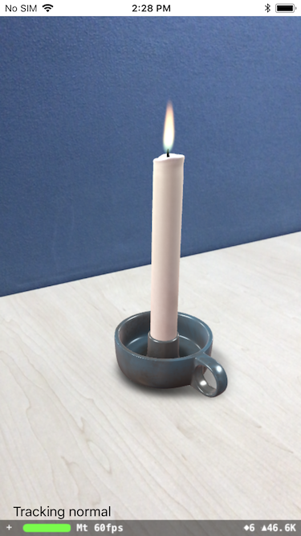

# ARKitAudio

This sample runs an ARKit world tracking session with content displayed in a SceneKit view. To demonstrate plane detection, the app simply places a 3D model onto the first plane that ARKit detects. If the model's position is outside the current field of view of the camera, the app uses SceneKit's positional audio feature to indicate which direction to turn the device to see the model.

## Build Requirements

Xcode 9.0 or later; iOS 11.0 SDK or later

## Refs

- [Original sample](https://developer.apple.com/library/content/samplecode/AudioInARKit/Introduction/Intro.html)
- [Documentation](https://developer.apple.com/documentation/arkit/)

## Target

This sample is runnable on iPhone/iPad devices since it requires a real camera.

## License

Xamarin port changes are released under the MIT license.

## Author

Ported to Xamarin.iOS by Mykyta Bondarenko
