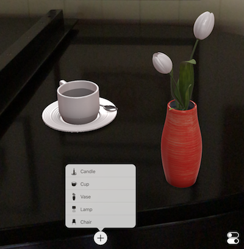

ARKit Sample "Placing Objects"
============

This sample is an ARKit augmented reality demo: you can place objects on detected surfaces.

To test this sample you'll need to deploy it on a device running iOS 11 software - doesn't work on the simulator.

License
-------

Xamarin port changes are released under the MIT license

Author
------

Ported to Xamarin.iOS by Larry O'Brien, Kevin Mullins
