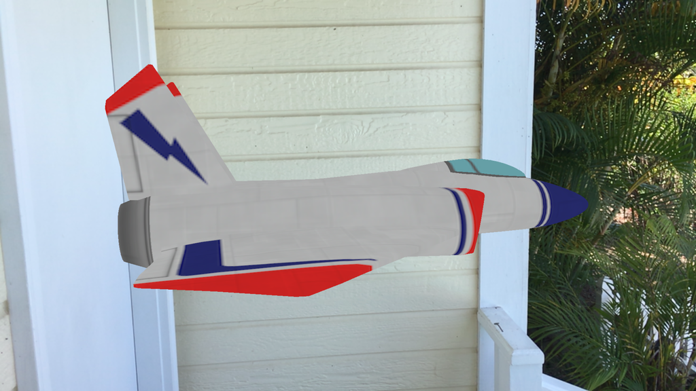

ARKit Sample
============

This sample is a simple ARKit augmented reality demo.

To test this sample you'll need to deploy it on a device running iOS 11 beta software.

By default, the sample presents a jet in a fixed location. To animate the jet around the viewer find the `HACK` in **GameViewController.cs**: comment out the line `ship.Position = new SCNVector3(2f, -2f, -9f);` and uncomment the code that creates an animation around a pivot node.

License
-------

Xamarin port changes are released under the MIT license

Author
------

Ported to Xamarin.iOS by Kevin Mullins, Larry O'Brien
