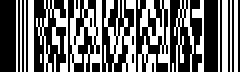
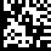

AVCamBarcode
============

This sample demonstrates how to use the AVFoundation capture API to detect barcodes and faces.

Machine Readable Codes
-------

* QR code 

    
* PDF-417 

    
* Data Matrix 

    

Build Requirements
-------

Xcode 9.0 or later; iOS 11.0 SDK or later

Target
-------

This sample runnable on iPhone/iPad devices since it requires a real camera.

Author
------

Ported to Xamarin.iOS by Mykyta Bondarenko, Rustam Zaitov