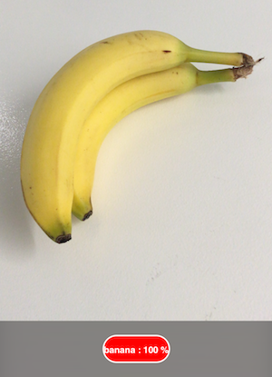

CoreML with Azure Custom Vision Service
============

This sample "CustomVision" is a demo of the new iOS 11 Vision framework and CoreML, using a model
trained with Azure's Custom Vision Service.

This [introduction to CoreML and the custom vision service](https://azure.microsoft.com/en-us/blog/custom-vision-service-introduces-classifier-export-starting-with-coreml-for-ios-11/)
explains the process and links to the [Swift source](https://github.com/Azure-Samples/cognitive-services-ios-customvision-sample)
that has been ported to C# with Xamarin.

The custom model has been trained to recognize differet varieties of fruit:

License
-------

Xamarin port changes are released under the MIT license

Author
------

Ported to Xamarin.iOS by Larry O'Brien, Craig Dunn
