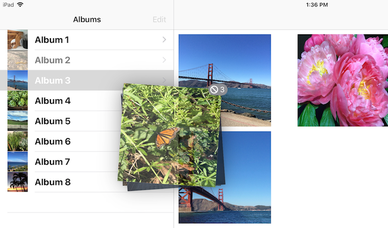

# Drag and Drop CollectionView Example

This sample is a demo of the new iOS 11 Drag and Drop feature using UICollectionView & UITableView.

Test this app on an iPad - the drag and drop functionality does not work on iPhone. Things you can do:

* Individual photos can be moved within an album, or dragged to a new album (use your other hand to select :)
* Entire albums can be dragged, moving all the photos inside to the new album
* Individual photos can be dragged into other apps (eg. Messages)
* Entire albums can be dragged into other apps (eg. Messages), copying all the photos inside to the other app
* Albums can be re-ordered using the **Edit** button and row tabs
* New images can be dynamically generated with the **Start Insertions** button

## License

Xamarin port changes are released under the MIT license
