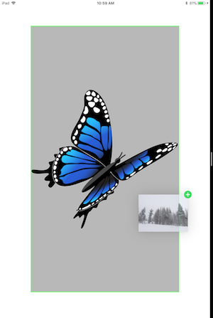

# Drag and Drop Custom View Example

This sample is a demo of the new iOS 11 Drag and Drop feature in a custom view

Test this app on an iPad - the drag and drop functionality does not work on iPhone. Open an app that handles images (such as Photos) side-by-side with this sample and drag items between the two apps.

## License

Xamarin port changes are released under the MIT license

## Author

Ported to Xamarin.iOS by Vincent Dondain
