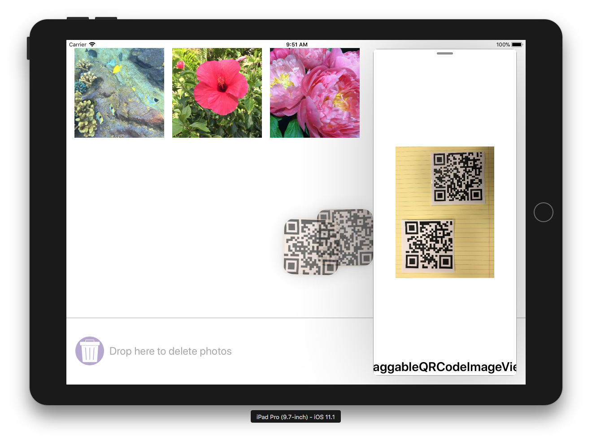

# Mastering Drag and Drop in iOS 11

There are two app projects in this sample, intended to be run at the same time on an iPad. The *DragSource* app contains a variety of different types of data for dragging, and the *DragTarget* offers a convenient place to drop them.

Swift sample available from [WWDC 2017 Mastering Drag and Drop](https://developer.apple.com/videos/play/wwdc2017/213/). See the [original readme](DragAndDropCommon/README.md) for more information.

## License

Xamarin port changes are released under the MIT license

## Author

Ported to Xamarin.iOS by Kevin Mullins, Amy Burns
