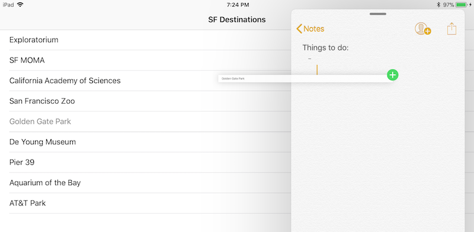

Drag and Drop TableView Example
============

This sample is a demo of the new iOS 11 Drag and Drop feature using for a UITableView

Test this app on an iPad - the drag and drop functionality does not work on iPhone. Open an app (such as Notes) side-by-side with this sample and drag text items between the two apps.

License
-------

Xamarin port changes are released under the MIT license

Author
------

Ported to Xamarin.iOS by Craig Dunn
