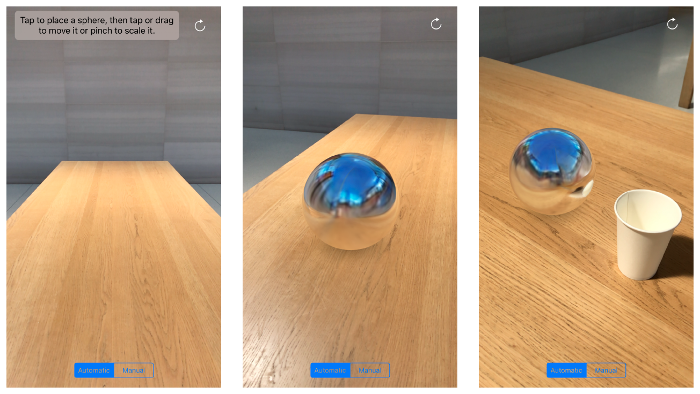

# Adding Realistic Reflections to an AR Experience

Use ARKit to generate environment probe textures from camera imagery and render reflective virtual objects.

This app provides a simple AR experience demonstrating the environment texturing features in ARKit 2 and SceneKit. After you build and run the app, explore your surroundings in the camera view. Then, tap a nearby horizontal surface to place a virtual object: a mirror-finish sphere. After you place the object, you can drag it around or tap to move it to another location. You can also pinch to make the object bigger or smaller. 

## Build Requirements

Xamarin.iOS 12.0, Xcode 10.0 and two or more iOS devices with A9 or later processors.

## Related Links

- [Original sample](https://developer.apple.com/documentation/arkit/adding_realistic_reflections_to_an_ar_experience).
- [Documentation](https://developer.apple.com/documentation/arkit/arenvironmentprobeanchor)

## License

Xamarin port changes are released under the MIT license.

## Author

Ported to Xamarin.iOS by Mykyta Bondarenko
