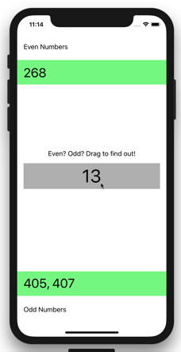

# Even/Odd Number Drag

This sample demonstrates how to use the iOS 11 Drag and Drop APIs within a 
single iPhone app.

The app shows a number in the middle of the screen, and the user's task is
to determine whether or not it is an even number or odd number by dragging
it to the appropriate bucket.

To test this sample you'll need to run it on a device/simulator running 
iOS 11.

