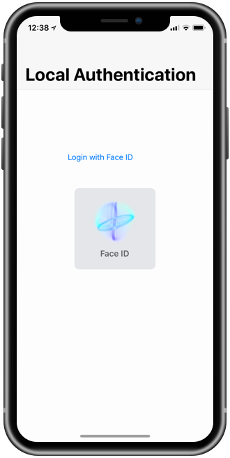

# Local Authentication using Face ID or Touch ID

Demonstrates how to use Face ID and Touch ID to authenticate the user.

Refer to the [Introduction to Touch ID](https://docs.microsoft.com/en-us/xamarin/ios/platform/touchid) guide.

## See Also

* [KeychainTouchID Sample](https://developer.xamarin.com/samples/monotouch/ios8/KeychainTouchID) – for accesing the Keychain
* [iOS 8 Local Authentication Sample](https://github.com/xamarin/ios-samples/tree/master/StoryboardTable_LocalAuthentication) - deprecated by this iOS 11 sample
