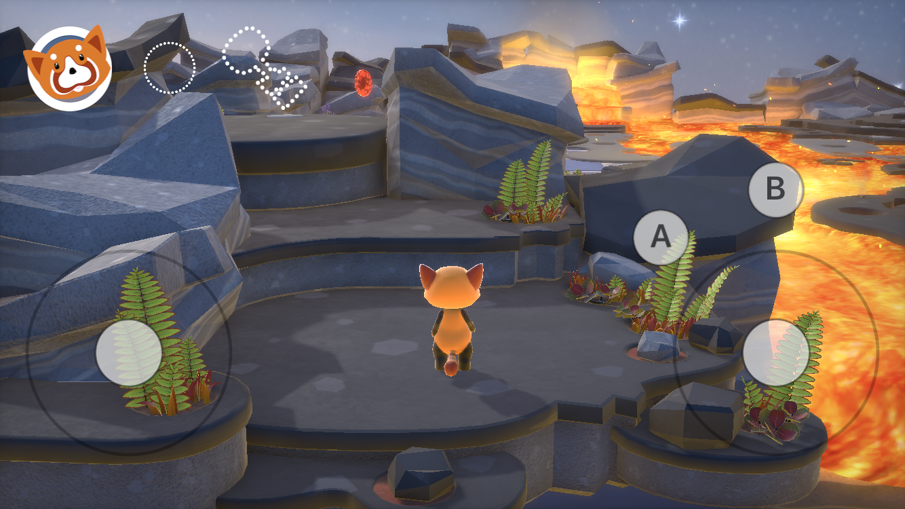

Fox 2: SceneKit
============

This sample code demonstrates the following Scene Kit features that were added in iOS 11, tvOS 11, and macOS 10.13:

- Camera constraints define the camera behaviour of the app/game
- A new physically-based depth of field effect achieved with “bokeh”
- Screen space GPU tessellation (using Pixar’s openSubdiv)
- Animation of character tones using a new animation engine (and API)
- Cascaded shadow maps
- GameplayKit integration

Build Requirements
-------

Xcode 9.0 or later; iOS 11 or later, tvOS 11 or later, macOS 10.13 or later

Related Links
-------

- [Original sample](https://developer.apple.com/library/content/samplecode/scenekit-2017/Introduction/Intro.html)
- [Documentation](https://developer.apple.com/documentation/scenekit)

Target
-------

Fox 2 must be run on a physical device. Fox 2 does not support the iOS Simulator or tvOS Simulator.

License 
-------

Xamarin port changes are released under the MIT license.

Author
------

Ported to Xamarin.iOS/macOS/tvOS by Mykyta Bondarenko
