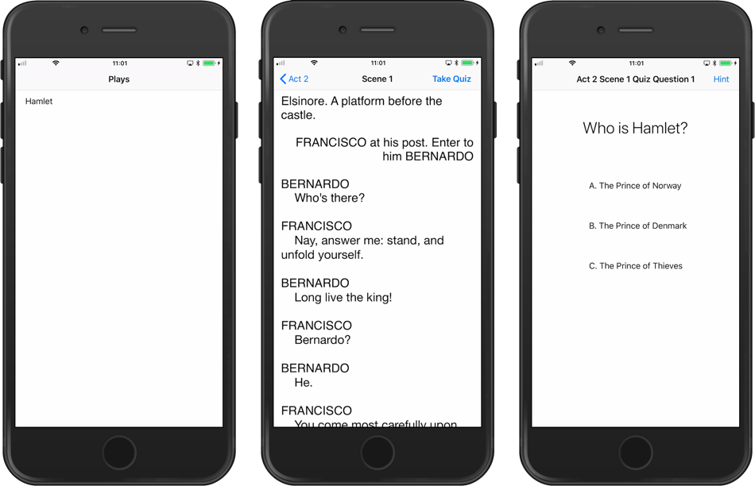

GreatPlays ClassKit Example
===========================

This is a line-by-line port of Apple's [Incorporating ClassKit Into An Educational App](https://developer.apple.com/documentation/classkit/incorporating_classkit_into_an_educational_app) sample.



Using this sample
-----------------

- This sample will only work on physical devices running iOS 11.4 or
  higher.

- Add the ClassKit capability

  Building ClassKit-enabled applications requires the ClassKit
  capability, which is not yet supported by Visual Studio 2017 or Visual
  Studio for Mac. See the [known issues in the Xamarin.iOS release
  notes](https://github.com/xamarin/xamarin-macios/wiki/xamarin.ios_11.9.2#known-issues)
  for details and a workaround.

  Visit [Certificates, Identifiers, and
  Profiles](https://developer.apple.com/account/ios/certificate/) in the
  Apple Developer portal to manually request a provisioning profile with
  the ClassKit capability enabled so you can deploy to a physical device.

  If you need aditional information on how to work with device capabilities
  please visit the Xamarin.iOS [documentation 
  site](https://docs.microsoft.com/en-us/xamarin/ios/deploy-test/provisioning/capabilities/?tabs=vsmac#developer-center)
  on the subject.

- Install the Schoolwork App

  In order to work with this sample, you'll need Apple's **Schoolwork**
  app. To request access to this app, use [this
  form](https://developer.apple.com/contact/classkit/).

- More information about testing ClassKit-enabled application can be
  found in the [ClassKit
  documentation](https://developer.apple.com/documentation/classkit/testing_your_app_during_development).

#### Running this sample without Schoolwork app

This sample can be run without the Schoolwork app installed on your device but you are likely to get errors logged in your console. For example:

```
GreatPlays[1333:1830578] [default] Error: Error Domain=com.apple.ClassKit Code=9 "Save failed!" UserInfo={NSLocalizedDescription=Save failed!, CLSErrorUnderlyingErrorsKey=(
    "Error Domain=com.apple.ClassKit Code=4 \"Saving object not allowed.\" UserInfo={NSLocalizedDescription=Saving object not allowed., CLSErrorObjectKey=<CLSContext: 0x1c41981f0> (objectID: 70037a4c4057d9bab1a7976e07bfe9bdb4cbe553447271f2988faf9d) (dateCreated: 10/04/18 23:27) (dateLastModified: 10/04/18 23:27) (type: Book) (identifier: Hamlet) (title: Hamlet) (topic: LiteracyAndWriting)}",
    "Error Domain=com.apple.ClassKit Code=4 \"Saving object not allowed.\" UserInfo={NSLocalizedDescription=Saving object not allowed., CLSErrorObjectKey=<CLSContext: 0x1c4198120> (objectID: 50b559f69299b96928f20629e74c4711fffa377424435be966e1ffea) (dateCreated: 10/04/18 23:27) (dateLastModified: 10/04/18 23:27) (type: Chapter) (identifier: Act 5) (title: Act 5) (topic: LiteracyAndWriting)}"
)}
```

License
-------

Xamarin.iOS port is released under the MIT license

Author
------

Ported to Xamarin.iOS by [Alex Soto](https://github.com/dalexsoto)
