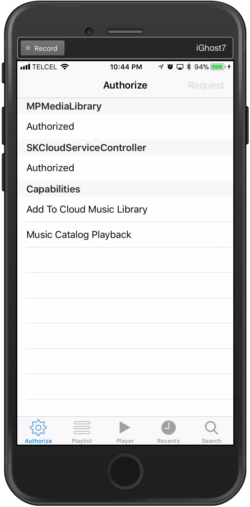

# MusicKitSample

MusicKit on iOS lets users play Apple Music and their local music library natively from your apps and games. When a user provides permission to their Apple Music account, your app can create playlists, add songs to their library, and play any of the millions of songs in the Apple Music catalog. If your app detects that the user is not yet an Apple Music member, you can offer a trial from within your app.

## License

Xamarin port changes are released under the MIT license.
