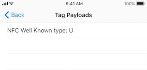

# NFCTagReader

This sample shows how to integrate Core NFC Framework into your application to enable NFC tag reading.

## Overview

Core NFC provides NFC tag reading capabilities to your applications.  This sample application will read an NDEF formatted NFC Forum tag (Type 1 to 5) that contains an NDEF message.  Clicking on the **Scan** button will start the tag scanning process.  The application will list each NDEF message read from the NFC tag in the main message table view with a single row entry, and the row's label displays the number of NDEF record payloads in the message.

Clicking on a row in the message table will display the payload table view with details on each of the NDEF record stored in the message.

## Getting Started

An iPhone 7 or iPhone 7 Plus running iOS 11 is required.  The first step is to enable "Near Field Communication Tag Reading" in the project's Capabilities pane to acquire the necessary entitlements.  Please visit ['Certificates, Identifiers, and Profiles'](https://developer.apple.com/account/ios/certificate/) in the Apple Developer portal to manually request a provisioning profile if the NFC capability is unavailable in your beta version of Xcode.
