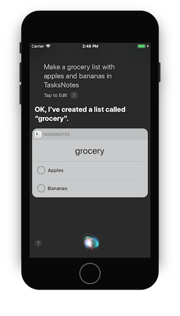

# SiriKit Sample "TasksNotes"

This sample is a demo of the new iOS 11 SiriKit domain _Lists and Notes_. It also uses the _Alternative App Name_ **Info.plist** setting.

 

## License

Code is released under the MIT license

## Author

Craig Dunn
