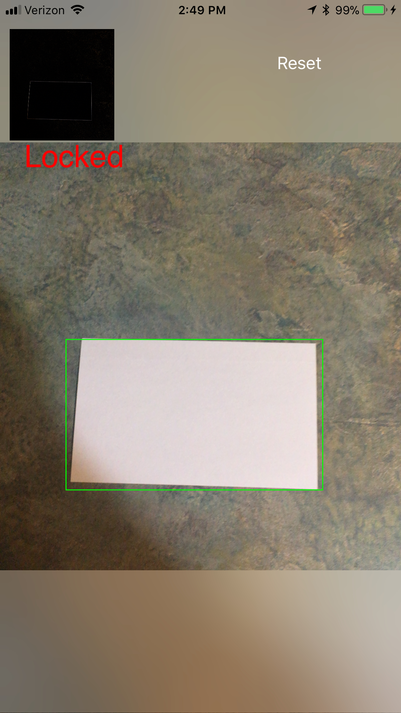

# Tracking Objects Example

This program demonstrates the rectangle and object-tracking capability of iOS 11's Vision namespace. These capabilities rely on a live video feed and so this application must be run on a device and not the Simulator.

After requesting access to the Camera, this application shows a live video feed, as well as a thumbnail of frames being sent to the Vision namespace. The thumbnail shows the results of the image-processing pipeline and is helpful for developers who modify the `VideoCaptureDelegate.CroppedSampleBuffer` method to remove or enhance edge detection or see if it's useful to try other techniques such as dilation, contrast enhancement, thresholding, and so forth.

The app first runs in a "scanning" mode, when it is detecting rectangles. Detected rectangles are outlined in blue. Touch inside a detected rectangle to activate "tracking" mode. In this mode, the tracked rectangle's bounding box is outlined in either green, yellow, or red, depending upon the confidence of the Vision namespace. (Note that this uses `VNDetectedObjectObservation` observations rather than `VNRectangleObservation` observations, which seem to be more "fragile" in terms of tracking.)

You'll notice that "tracking" mode isn't noticeably faster or more accurate than "scanning" mode. What tracking _does_ provide is the same object identity over subsequent frames which you can access via the [VNObservation.Uuid](https://developer.xamarin.com/api/property/Vision.VNObservation.Uuid/) property.
