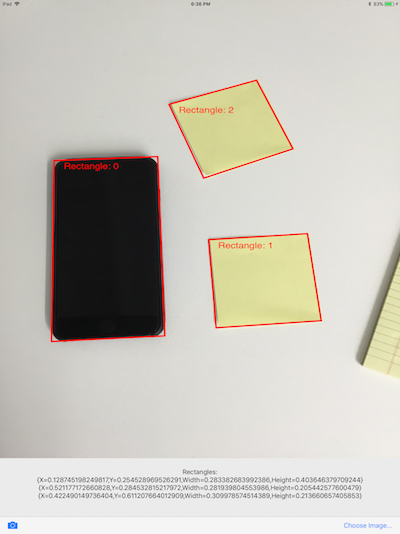

# Vision Rectangle Detection Example

This sample is a demo of the new iOS 11 Vision framework.

It detects rectangles; use the sample photos in the **TestImages** directory to give it a try (drag them onto the simulator or upload to your device, and **Choose Image...**).

## Author

Craig Dunn
