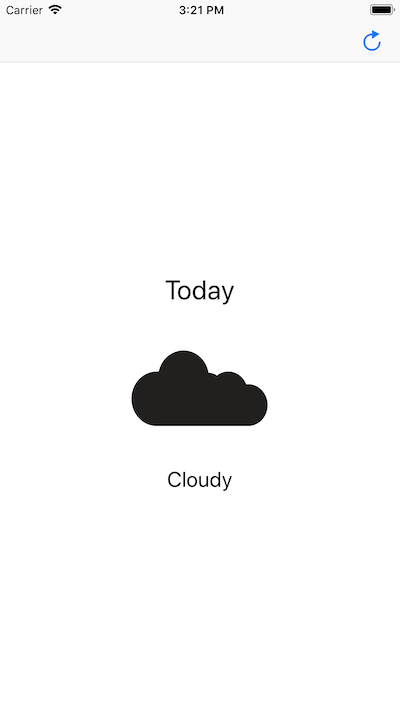

# Building a Simple Widget for the Today View

This sample code builds a weather app that displays a simple five-day weather forecast using a horizontally paging collection view. Each collection view cell contains a label showing the day the forecast applies to, an icon representing the forecast, and a label describing it. In this example, the Today extension provides a more compact, glanceable view of the app's data.

## Build Requirements

Xamarin.iOS 11.3+ and Xcode 10.0+.

## Related Links

- [Original sample](https://developer.apple.com/documentation/notificationcenter/building_a_simple_widget_for_the_today_view).
- [Documentation](https://developer.apple.com/documentation/notificationcenter)

## License

Xamarin port changes are released under the MIT license.

## Author

Ported to Xamarin.iOS by Mykyta Bondarenko
