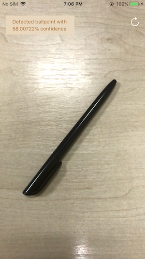

Vision in Real Time with ARKit
============

Manage Vision resources for efficient execution of a Core ML image classifier, and use SpriteKit to display image classifier output in AR.

Build Requirements
-------

Xamarin.iOS 11.0, Xcode 9.0 and a device with an A9 (or later) processor

Related Links
-------

- [Original sample](https://developer.apple.com/documentation/arkit/using_vision_in_real_time_with_arkit?language=objc)
- Documentation:
    - https://developer.apple.com/documentation/arkit
    - https://developer.apple.com/documentation/vision
    - https://developer.apple.com/documentation/coreml

License
-------

Xamarin port changes are released under the MIT license.

Author
------

Ported to Xamarin.iOS by Mykyta Bondarenko
