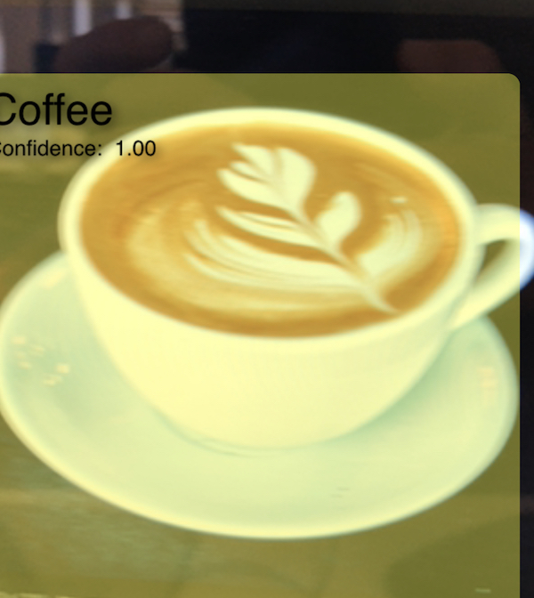

# Breakfast Finder

This sample is a C# port of Apple's
[Recognizing Objects in Live Capture](https://developer.apple.com/documentation/vision/recognizing_objects_in_live_capture?language=objc)
sample app.

It demonstrates how to use the Vision framework and Core ML in iOS 12 to
recognize objects in live video.

## Usage

**Note**: This sample will not run a simulator. It must be run on a physical
device running iOS 12 or later.

- Start the app, which opens a camera view.
- Point the camera towards breakfast foods of various kinds: a cup of
coffee, an egg, a banana, a waffle, or a croissant.
- The app will highlight and identify the breakfast foods it recognizes
in the live video.

## License
Xamarin port changes are released under the MIT license.

## Author
Ported to Xamarin.iOS by Brad Umbaugh

