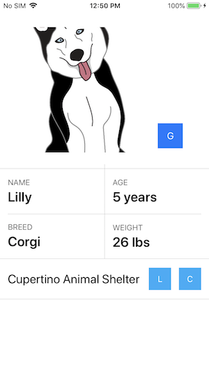

# Delivering an Exceptional Accessibility Experience

Make improvements to your app’s interaction model to support assistive technologies such as VoiceOver.

To see the sample app in action, use Visual Studio to build and run the app on your iOS device. Be sure to turn on VoiceOver, which you can do from Settings under **General > Accessibility > VoiceOver**.

## Build Requirements

Xamarin.iOS 12.0+ and Xcode 10.0+.

## Related Links

- [Original sample](https://developer.apple.com/documentation/uikit/accessibility/delivering_an_exceptional_accessibility_experience).
- [Documentation](https://developer.apple.com/documentation/uikit/accessibility)

## License

Xamarin port changes are released under the MIT license.

## Author

Ported to Xamarin.iOS by Mykyta Bondarenko
