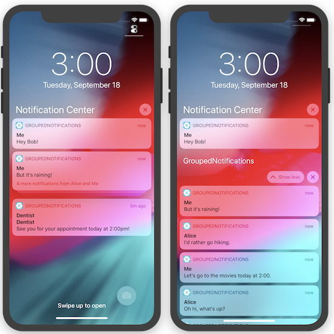

# Grouped Notifications

This sample app demonstrates how to use the User Notifications framework
to group notifications by their thread identifiers, a new feature 
introduced in iOS 12 to make it easier for users to work with notifications.

## Usage

To use the app: 

- Tap the **Message with Alice** button a few times.
- Tap the **Choose a new friend** button.
- Tap the **Message with Bob** button a few times.
- Tap the **Appointment reminder** button a few times.

After the notifications finish appearing, open up the Notification Center
by swiping down from the top of the device. You will see:

- A group of notifications for the conversation thread with Alice
- A group of notifications for the conversation thread with Bob
- A group of notifications for various appointments (these are not a
  thread, but iOS 12 by default groups together all app-related
  notifications not assigned to a specific thread)

## License
Code is released under the MIT license

## Author
Brad Umbaugh

