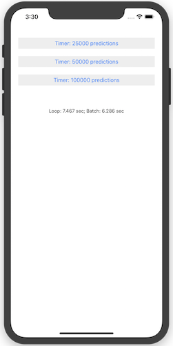

# MarsHabitatCoreMLTimer

This sample uses the **MarsHabitatPricer** Core ML model from Apple's
[Integrating a Core ML Model into Your App](https://developer.apple.com/documentation/coreml/integrating_a_core_ml_model_into_your_app?language=objc)
sample to demonstrate the performance benefit of using iOS 12's Core ML
batch prediction API instead of looping over the standard Core ML
prediction API.

## License
Code is released under the MIT license

## Author
Brad Umbaugh
