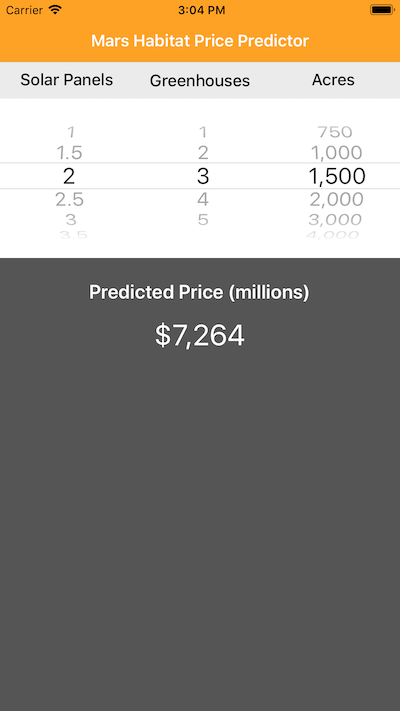

# Integrating a Core ML Model into Your App

Add a simple model to an app, pass input data to the model, and process the model's predictions. This app uses a trained model, `MarsHabitatPricer.mlmodel`, to predict habitat prices on Mars.

## Build Requirements

Xamarin.iOS 11.0 and Xcode 9.0.

## Related Links

- [Original sample](https://developer.apple.com/documentation/coreml/integrating_a_core_ml_model_into_your_app)

## License

Xamarin port changes are released under the MIT license.

## Author

Ported to Xamarin.iOS by Mykyta Bondarenko
