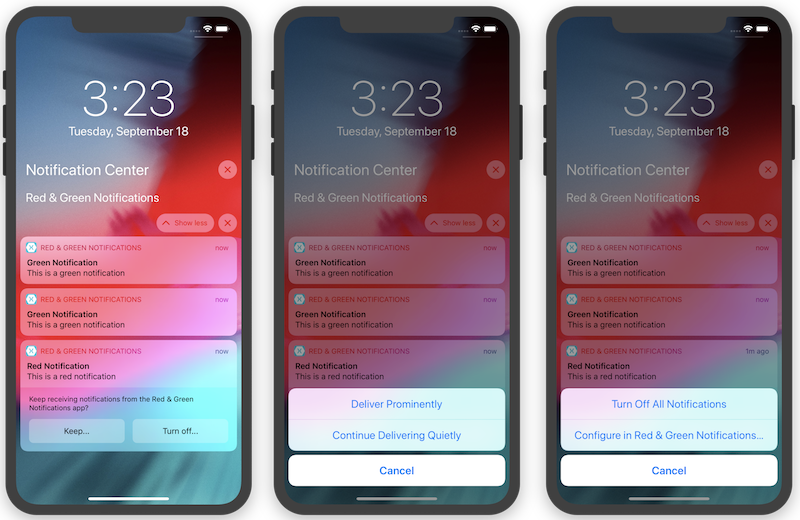

# Red & Green Notifications

iOS 12 introduced various notification-related features, including:

- Provisional notifications
- Notification management features
- Dynamic notification action buttons
- Interactive notification content
- Critical alerts (not covered in this sample)
- Grouped notifications (not covered in this sample)

This sample demonstrates how to:

- Send provisional notifications.
- Create a custom notification UI.
- Add dynamic action buttons to a custom notification UI.
- Add interactive interface elements to a custom notification view.
- Set up an in-app notification management screen to which iOS can directly 
link.

## Usage

- Run the app.
- Notice that the app does not ask for permission to send notifications.
This is because it sends provisional notifications – a feature added
in iOS 12 that delivers notifications quietly (only to the Notification 
Center, without an alert, and without a sound) by default, and without
needing explicit user permission.
- Tap the **Red notification** and **Green notification** buttons.
- iOS delivers these notifications quietly, since they are provisional.
- After a few seconds, swipe down from the top of your device or simulator
to view Notification Center.
- Use the management features on the provisional notifications to indicate 
whether or not you'd like to keep receiving them.
- In particular, tap **Turn off...** and then **Configure in Red & Green Notifications** 
to open the in-app notification management view and enable or disable red 
and green notifications individually.
- Use 3D Touch to open the custom notification view for the red and 
green notifications in Notification Center.
- Use the notification's action buttons to rotate the image in its custom
view. Notice that the notification action buttons change depending on the 
rotation of the image.
- Use the slider to adjust the image's opacity.
- Use the "Dismiss notification," "Remove notification," and "Launch app"
buttons in the custom notification view to close the notification, remove 
it from Notification Center, and launch the app.
- In the iOS Settings app, open up the notification settings for the Red & 
Green Notifications app, and tap **Red & Green Notifications Notification Settings** 
to jump to the in-app custom notification management screen.

## License
Code is released under the MIT license

## Author
Brad Umbaugh

