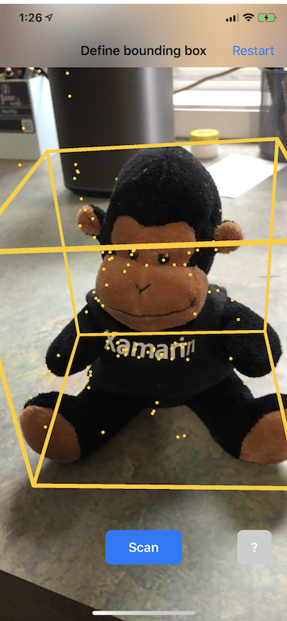
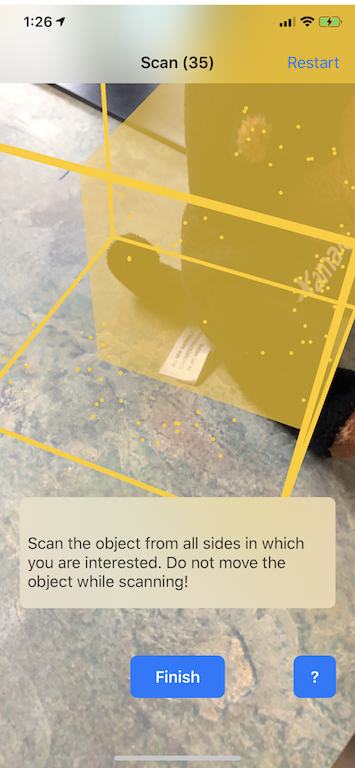

# Scanning App

This is a port of the Apple sample [Scanning and Detecting 3D Objects](https://developer.apple.com/documentation/arkit/scanning_and_detecting_3d_objects). The architecture and code design of the app follows that of the Swift app, with some exceptions discussed below.

This sample requires a device that supports ARKit's "object scanning" configuration (`ARObjectScanningConfiguration`). This configuration is processor-intensive and may not be supported or may not produce adequate tracking on older hardware. This configuration also "disables ARKit features not necessary for reference object scanning," and should only be used for, essentially, the use-case embodied in this app. 

The app is used by developers to scan a real-world object to create an `ARReferenceObject` definition that can be saved to a file and used in end-user mixed-reality apps (for instance, recognizing a sculpture or factory-floor machine).

## Usage

After ARKit initializes, a "ghost" bounding box will appear and try to fit around any object that is in the middle of the screen. Use pinch, pan, and two-finger pan to adjust the size of the bounding box until it is sufficient to encompass the scanned object. Points will appear within the bounding box, showing how well the object is being detected.



When the bounding box fully encloses your object, press "Scan" to begin scanning. Move the camera around the bounding box. As the scan retrieves sufficient points, the corresponding area on the bounding box will be covered with a translucent panel.



Once you've scanned the object from all sides horizontally and from the top, a set of axes will appear. Drag this with your finger to set the origin (within the bounding box) that you wish for your reference object. Press "Test" and a new AR session will begin, looking for your just-created `ARReferenceObject`. Move the object around, light it differently, etc. When the object is recognized, a bounding box will appear.


Press "Share" to save the `ARReferenceObject` to a file that can be used in your end-user apps!

## Notes

### Manual resource management in ARKit and SceneKit apps

In ARKit, it's crucial to manually manage resources. Not only does this allow high frame-rates, it actually is _necessary_ to avoid a confusing "screen freeze." The ARKit framework is lazy about supplying a new camera frame (`ARSession.CurrentFrame`). Until the current `ARFrame` has had `Dispose()` called on it, ARKit will not supply a new frame! This has the appearance of the video "freezing" even though the rest of the app is responsive. The solution is to always access it with a `using` block (see `ViewControllerSCNViewDelegate.Update` in this example) or manually call `Dispose()` on it.

Beyond the `ARSession.CurrentFrame`, the major resource that needs to be managed carefully in this app are instances of `PointCloud`. This is a visualization of the raw feature points being sensed by ARKit. While this is not called _every_ frame, it's called often enough that it would lead to significant memory consumption. You'll note that prior to the factory method `PointCloud.CreateVisualization` is called, the app takes care to call `Dispose()` on the current `PointCloud`.

Another complex use of `Dispose()` relates to notifications. The Apple design uses the Observer pattern to subscribe to various state changes (e.g., `NSNotificationCenter.DefaultCenter.AddObserver(Scan.ScanningStateChangedNotificationName, ScanningStateChanged);` ). You _must_  unsubscribe from such observations while `Dispose()`ing your object or you will get a segfault when the system attempts to alert your now-deallocated object of the notification. The pattern is simple:

```csharp
class MyClass : NSObject
{
    private NSObject notificationObservationHandle;

    MyClass()
    {
        notificationObservationHandle = NSNotificationCenter.DefaultCenter.AddObserver(notificationName, NotificationHandler);
    }

    private bool disposed = false;
    override protected void Dispose(bool disposing)
    {
        if (!disposed)
        {
            if (disposing)
            {
                NSNotificationCenter.DefaultCenter.RemoveObserver(notificationObserverHandle);
            }
            disposed = true;
            base.Dispose();
        }
    }
}
```

Note that when implementing the `Dispose` pattern in Xamarin, you must set `disposed = true` prior to calling `base.Dispose()` in objects that are derived from `NSObject`. Xamarin's implementation of `NSObject.Dispose()` calls `Dispose(true)`, which will cause the stack to overflow if `disposed` is not already set.

Related: There are more shared references within the Swift code than I'd prefer, so I tried to convert as many as possible into properties with `private` setters.

### Fast, unsafe code to create `PointCloud`

Because the `PointCloud` is a short-lived object reflecting complex geometry (the raw feature points that ARKit is seeing within the target bounding box), I use `unsafe` code to create it directly from an `NVector3` array rather than loop over each `NVector3`, allocate an `SCNSphere` for that point, add that sphere to the current `SCNNode` etc. 

The `PointCloud.CreateVisualization` combines two techniques to create complex `SCNGeometry` as quickly as possible: first, the array is pinned and accessed as an `NSData` byte buffer. Second, a template `SCNGeometryElement` is created and the data buffer and the template are "zipped together" using `SCNGeometry.Create(SCNGeometrySource[], SCNGeometryElement[])`.  

This is a good technique to have in your toolkit.

### The threshold-aware gestures are nice

The gestures for moving and rotating the bounding box and origin only respond to touches that have either moved or rotated more than some threshold amount. The code in `ThresholdPanGestureRecognizer`, `ThresholdPinchGestureRecognizer` and `ThresholdRotationGestureRecognizer` should be quite reusable. 

### Matrix types and performance

In any 3D application, you're going to be dealing with 4x4 transformation matrices. In SceneKit, these are `SCNMatrix4` objects.  

The `SCNNode.Transform` property returns the `SCNMatrix4` transform matrix for the `SCNNode` _as backed by_ the row-major `simdfloat4x4` type. So, for instance:

```csharp
var node = new SCNNode { Position = new SCNVector3(2, 3, 4) };  
var xform = node.Transform;
Console.WriteLine(xform);
// Output is: "(1, 0, 0, 0)\n(0, 1, 0, 0)\n(0, 0, 1, 0)\n(2, 3, 4, 1)"
```

As you can see, the position is encoded in the bottom row's first 3 elements. This might be transposed (sideways) to your expectations. The functions `SCNMatrix4 ToSCNMatrix4(this NMatrix4 self)` and `NMatrix4 ToNMatrix4(this SCNMatrix4 self)` use the `M{col}{row}` fields to assure the values are proper, so that's fine, but there _is_ a small performance cost to changing the representation, so avoid needless conversions.

### Avoiding ghostBoundingBox Dispose() asynch defect

The original code contained an asynch bug. The ghost bounding box is removed if, during a frame update, the `ARSceneView.SmartHitTest()` (extension method defined in ARSCNView\_Extensions.cs) returns `null` because no feature points are detected (this will happen if the camera is brought within 20cm of the bounding box). This is done in the `result == null` path at the beginning of `ScannedObject.UpdateOrCreateGhostBoundingBox()`. 

However, when the `Scan` object has called the asynchronous `ARSession.CreateReferenceObject()` the handler contains a reference to the `ScannedObject.ghostBoundingBox`. If, prior to the handler executing, the `ghostBoundingBox` has been removed as just described, the app throws `ObjectDisposedException`. 

To avoid this, we added the `ScannedObject.LockBoundingBoxForReferenceObjectCreation()` method and the related `busyCreatingReferenceObject` field. 

An alternate possibility would be to re-acquire the reference in the `CreateReferenceObject` handler (i.e., rather than pass in `boundingBox` make another call to `ScannedObject.EitherBoundingBox`) but I’m not sure if there are no consequences to the reference changing during the asynch period of `CreateReferenceObject()`.  

### SimpleBox<T>

The class `SimpleBox` is used to wrap .NET value objects in an `NSObject` that can be stored in iOS `NSDictionary` objects and used in the payload for `NSNotification` objects. It is helpful but should be used sparingly, as it will cause Ahead-of-Time compilation (AoT) to generate at compile-time the variations for all the different values of `T`.

### Classes in the `Controllers` directory

The Swift code uses five files to organize the behavior of the single class `ViewController`. In C# these would be called "partial classes." I put the code in different classes, as this makes it easier to reason about the state and responsibilities of each individual class.

### Minor structural differences

I occasionally refactored the Swift code where I thought it helped legibility or reduced repetition. Usually this was in the form of extracting a function.

One area where there is considerably variance from the Swift code is in the "Utility_Extensions" folder. Xamarin.iOS uses OpenTK vector and matrix classes for manipulating 3D objects and transforms. The OpenTK classes have different APIs and 

A matter of internal debate was the clearest form for porting Swift `guard` statements that assign a local variable if the passed-in variable is not `null`. The options are:

- Explicit check and branch :

    ```csharp
    var someReference = passedInReference as TargetType;
    if (someReference == null)
    {
        return; 
    }
    // ... use someReference
    ```

- Pattern match:

    ```csharp
    if (! passedInReference is TargetType someReference)
    {
        return;
    }
    // ... use someReference
    ```

I chose to use the former solely because the pattern matching form is still relatively new and therefore might be less familiar to some developers.  

## License

Xamarin port changes are released under the MIT license.
