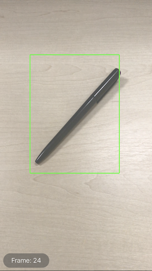

# Tracking Multiple Objects or Rectangles in Video

This sample demonstrates how to apply Vision algorithms to track objects or rectangles throughout a video.

## Build Requirements

Xamarin.iOS 12.0 or later; Xcode 10.0 or later;

## Related Links

- [Original sample](https://developer.apple.com/documentation/vision/tracking_multiple_objects_or_rectangles_in_video).
- [Documentation](https://developer.apple.com/documentation/vision)

## License

Xamarin port changes are released under the MIT license.

## Author

Ported to Xamarin.iOS by Mykyta Bondarenko
