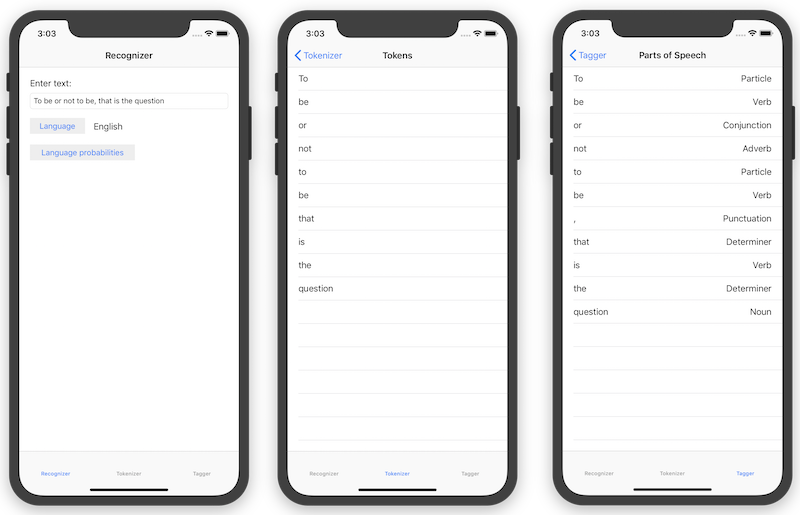

# XamarinNL

This app demonstrates how to use Apple's Natural Language framework
to recognize languages, tokenize text into words and sentences, and
tag named entities and parts of speech in a body of text.

## License
Code is released under the MIT license

## Author
Brad Umbaugh