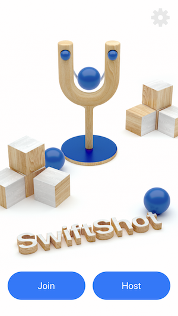
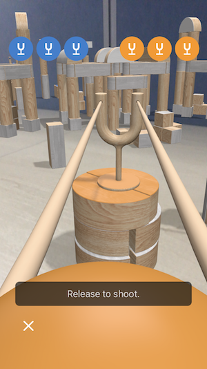

SwiftShot: Creating a Game for Augmented Reality
============

SwiftShot is an AR game for two to six players, featured in the WWDC18 keynote. Use this sample code project to experience it on your own device, see how it works, and build your own customized version of the game.

Build Requirements
-------

Xamarin.iOS 12.0, Xcode 10.0 and an iOS device with A9 or later processor. ARKit is not supported in iOS Simulator.

Related Links
-------

- [Original sample](https://developer.apple.com/documentation/arkit/swiftshot_creating_a_game_for_augmented_reality)

License
-------

Xamarin port changes are released under the MIT license.

Author
------

Ported to Xamarin.iOS by Mykyta Bondarenko
