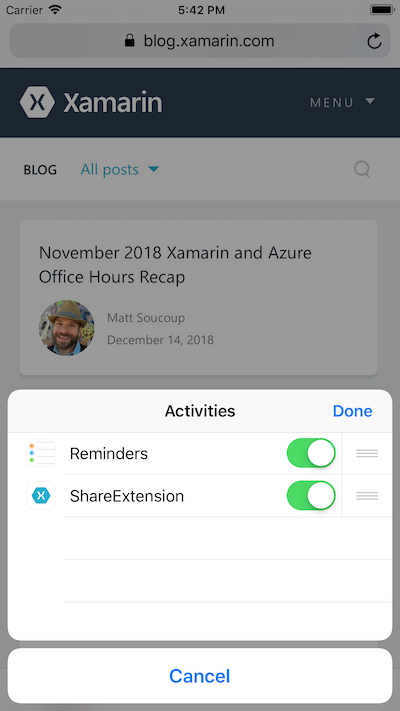

# Share

This is an app extension sample using the Share Extension. The extension is avaible across the whole system by clicking on the iOS share button (square + arrow). It provides a simple view related to the content you wanted to share and prompts you when you tap the "post" button.

## Instructions

To enable the extension:

* Go to an app who has a share button (like Safari).
* On the line where you see Mail, Twitter and Facebook, click on "more".
* Enable the ShareExtension.

## Build Requirements

Building this sample requires Xcode 6.0 and iOS 8.0 SDK.

## License

Xamarin port changes are released under the MIT license
