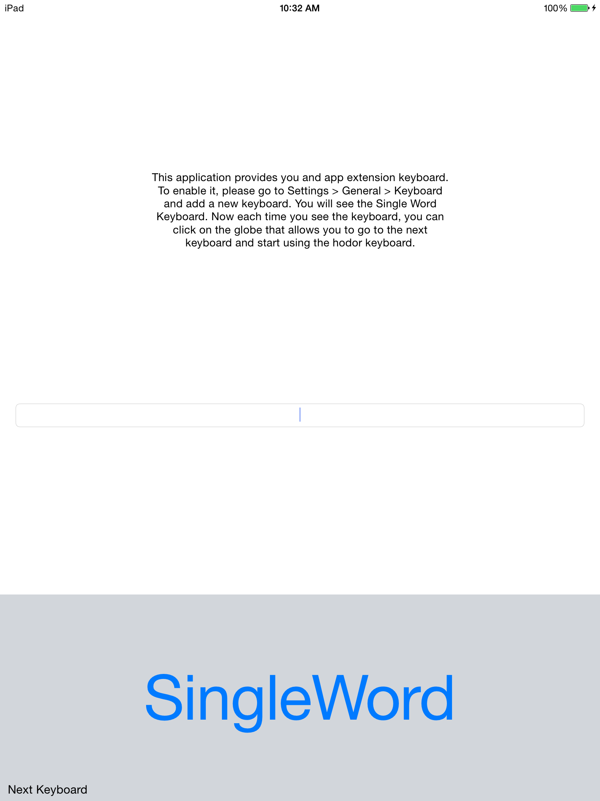

# Single Word Keyboard

This is an app extension sample. It uses the Keyboard Extension to provide a new keyboard for the system that has a unique button.

## Instructions

To enable the keyboard:

* Go to Settings > General > Keyboard.
* Add a new keyboard.
* Now each time you see the keyboard, you can click on the globe that allows you to go to the next keyboard and start using the Single Word Keyboard.

## Build requirements

Building this sample requires Xcode 6.0 and iOS 8.0 SDK

## License

Xamarin port changes are released under the MIT license
