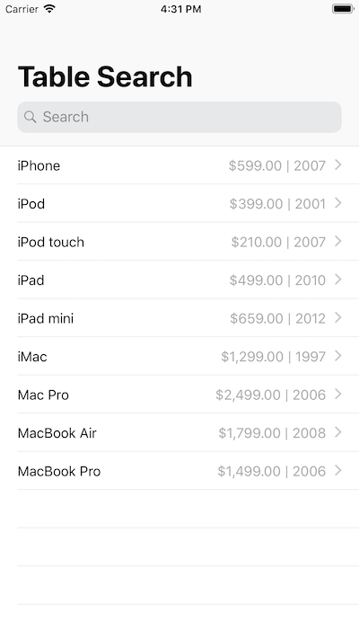

# Table Search with UISearchController

This sample demonstrates how to create a table view controller and search controller to manage the display of searchable content. It creates another custom table view controller to display the search results. This table view controller also acts as the presenter or provides context for the search results so they're presented within their own context.

This sample includes the optional—but recommended—[`UIStateRestoring`](https://developer.apple.com/documentation/uikit/uistaterestoring) protocol. You adopt this protocol from the view controller class to save the search bar's active state, first responder status, and search bar text and restore them when the app is relaunched.

## Build Requirements

Xcode 10.0 or later and iOS 10 or later.

## Related Links

- [Original sample](https://developer.apple.com/documentation/uikit/view_controllers/displaying_searchable_content_by_using_a_search_controller#//apple_ref/doc/uid/TP40014683)

## License

Xamarin port changes are released under the MIT license.

## Author 

Ported to Xamarin.iOS by Oleg Demchenko/Mykyta Bondarenko
